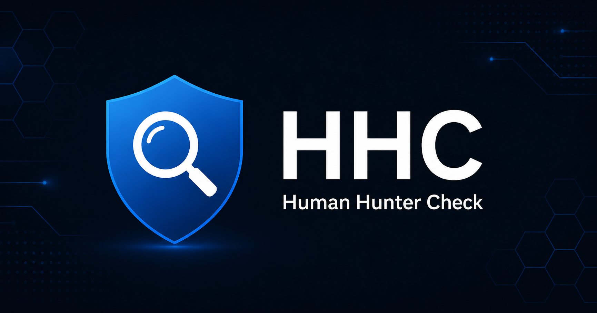

# HHC — Human Hunter Check

<p align="center">
  
</p>

A **local-first, self-triage tool** to assess a suspicious counterparty and
corroborate it from **public, lawful** OSINT sources. It covers two directions:

- **You are the target** — a job / headhunting approach (often on LinkedIn) that
  is actually a **foreign-intelligence recruitment attempt**.
- **You are hiring / contracting** — an **applicant or freelance contractor with a
  fraudulent identity** seeking access to your systems, data, or code (e.g. the
  DPRK IT-worker fraud).

Built from the design spec (`HHC_design_v1.1.md`), aligned with the 2026 Five Eyes
joint warning, UK NPSA *Think Before You Link*, and Japan PSIA economic-security
guidance.

## What it is — and is NOT

- It **never** labels a person a "spy" and **never** renders a guilty/innocent
  verdict. Output is only a **risk band (low / medium / high)** plus a
  **recommended action**.
- It uses **public, lawful sources only** (no LinkedIn scraping, no login-gated
  access).
- **State / intelligence nexus is captured primarily by category F** — matching
  the entity, person, and **affiliated institution** (employer / university /
  research institute) against public danger lists (OFAC, BIS Entity List,
  OpenSanctions, PEP, METI, …). Education is judged by **verifiability (B3)** and
  **listed-institution match (F)**, not by where someone studied.
- **Category G (state nexus, optional)** is a **human-set** nationality / origin /
  state-affiliation factor for the intended audience (Japanese / allied users
  triaging an inbound approach). It uses a **configurable "states of concern"
  list**, performs **no automated ethnicity inference** (the AI/OSINT may only map
  an *explicitly stated or entity-established* affiliation, never a guess from a
  photo or name), and — like everything else — a **non-match never lowers risk**
  (fake / third-country / fake-Western identities evade it). It is carried as an
  indicator id (`G1`), so the score computation and the case DB never store a raw
  nationality string.
- It still **never** labels a person a "spy" and renders no guilty verdict.
- "No evidence" is **not** evidence of innocence. Absence from a list never lowers
  the score.

## Status

All phases implemented (100+ tests, all run with no network and no API key).

| Phase | Scope | State |
|------|-------|-------|
| **A** | Layer-1: A–F checklist, deterministic §3 scoring + critical-flag overrides, bands + 4R actions, JA/EN, offline | ✅ |
| **B** | §6 AI interpret (pasted text / screenshots → human-confirmed checklist prefill) | ✅ |
| **C** | §7 OSINT verification agent + tool registry (RDAP, crt.sh, OpenSanctions incl. METI, Trade.gov CSL, NTA 法人番号, gBizINFO, OpenCorporates, reverse-image links, web search) | ✅ |
| **D** | Encrypted local case DB (SQLCipher), identity/clustering, volatility cache, diff, threat stats incl. coordinated-targeting | ✅ |
| **E** | Evidence snapshots (timestamp+SHA-256), CSIRT/authority report drafts, calibration + acceptance tests, CI | ✅ |

## Architecture

A local-first monorepo (npm workspaces):

- **`shared/`** — the single source of truth: `indicators.json` (§2), the
  authoritative deterministic scoring + overrides (`scoring.ts`), schemas, and
  guardrails. Consumed as TypeScript source by both web and agent, so the score is
  identical everywhere and **always overrides** any AI/agent suggestion.
- **`web/`** — React + Vite Layer-1 UI (bilingual JA/EN). Keyless and
  offline-capable; calls the agent backend only on explicit action.
- **`agent/`** — *(Phase B+)* Node backend that holds your Anthropic API key and
  runs §6/§7 and the encrypted case DB. Never part of the static front end.
- **`data/`** — *(Phase D+)* gitignored encrypted case DB + OSINT cache.

## Quickstart (Layer-1, keyless)

Requires Node 20+ (tested on Node 22).

```bash
npm install
npm test            # 100+ deterministic tests, no network, no API key
npm run typecheck
npm run dev:web     # open the printed localhost URL
npm run build       # production build of the Layer-1 UI
```

Layer-1 needs **no API key and no network**: tick the checklist, get a band +
recommended action, copy a report draft, and freeze a SHA-256 evidence snapshot.

## Run in GitHub Codespaces (browser, keys in Secrets)

> Launch / update / troubleshooting guide: [English](docs/en/launch-guide.md) · [日本語](docs/ja/launch-guide.md)

Run the whole thing from a browser with your API key stored as a **Codespaces
secret** — never in the repo or on disk. The devcontainer maps the secret to the
env var the backend already reads.

1. **Add the secrets** (do this *before* creating the Codespace):
   GitHub → this repo → **Settings ▸ Secrets and variables ▸ Codespaces ▸ New
   repository secret** (or your account **Settings ▸ Codespaces ▸ Secrets** to
   reuse across repos). Add:
   - `ANTHROPIC_API_KEY` — from <https://console.anthropic.com> (the API is
     separate from a Claude.ai subscription). Required for §6/§7. *(A secret named
     `HHC_KEY` is also accepted as an alias for this.)*
   - `HHC_DB_KEY` — any strong passphrase, *optional*, enables encrypted case
     history (§7.3).
   Make sure the secret's repository access includes this repo.
2. **Create the Codespace**: repo → **Code ▸ Codespaces ▸ Create codespace** on
   `claude/festive-babbage-JiOcC` (or your branch). It runs `npm install`
   automatically.
3. **It auto-starts.** A VS Code task (`HHC dev`) launches the agent + web when the
   Codespace opens — no terminal needed. (If prompted, allow automatic tasks. To
   run it by hand instead: `npm run dev`. For sample case history first, run
   `npm run seed` once.)
4. Port **5173** auto-forwards and the **UI opens in your browser** — that's the
   whole app. The web proxies `/api` to the in-container agent, so your key stays
   server-side and port 8787 is never exposed.

> **Browser-based, with a tiny local backend.** The Layer-1 checklist is pure
> browser. §6/§7 and the encrypted case DB run in a small backend *inside the same
> Codespace* because an API key must never live in browser/static code (§9) — in
> Codespaces it auto-starts and you only ever interact with the browser tab.

> Secrets are injected at container start. If you add/clip a secret to an existing
> Codespace, run **“Codespaces: Rebuild Container”** (or restart it) so the new
> value is picked up. The in-app status badge shows whether the key was detected.

## Full local run (§6 interpret, §7 OSINT, case history)

```bash
cp .env.example .env          # then set ANTHROPIC_API_KEY and HHC_DB_KEY
npm run seed                  # (optional) seed sample case history for the demo
npm run dev:agent             # local backend on 127.0.0.1:8787 (holds your key)
npm run dev:web               # the UI proxies /api → the agent
```

- **§6** turns a pasted DM / screenshot into *suggested* checklist ticks (you
  confirm each). Consent-gated; nothing is persisted server-side.
- **§7** corroborates a subject from public sources and screens the recruiter
  **and the affiliated employer/university/institute** against danger lists;
  matches are candidates that score **only after you confirm identity**.
- **Case history** (needs `HHC_DB_KEY`) gives instant recall of repeat
  approaches, diffs on re-checks, and a personal threat-landscape view including
  coordinated-targeting alerts. Stored encrypted under `data/` (gitignored).

Every OSINT source degrades gracefully: if a credential is missing or
`HHC_OFFLINE=1`, that tool reports *unavailable* (and "absence ≠ innocence")
instead of failing the run. Free source registrations (NTA app ID, Trade.gov,
OpenSanctions/OpenCorporates) are listed in `.env.example`; the keyless paths
(RDAP, crt.sh, self-hosted OpenSanctions, reverse-image links) work immediately.

## Authentication, accounts & MFA (optional)

Off by default (`HHC_AUTH=0`) — HHC stays keyless/local as above. Set **`HHC_AUTH=1`**
to require login for the whole app: email-ID accounts with **Admin / User** roles,
password + **MFA (TOTP and/or email codes)**, an Admin user-management screen, and
(Phase 2) an audit log + dashboard. Accounts live in the existing encrypted SQLCipher
DB, so `HHC_DB_KEY` and `HHC_SESSION_SECRET` become **required** when auth is on.

Enable it (Codespaces secrets or `.env`):

```
HHC_AUTH=1
HHC_DB_KEY=<strong passphrase>
HHC_SESSION_SECRET=<openssl rand -base64 48>
HHC_ADMIN_EMAIL=you@example.com
HHC_ADMIN_INITIAL_PASSWORD=<temporary password>
# optional, for email-code MFA (else use TOTP): SMTP_HOST/PORT/SECURE/USER/PASS/FROM
```

- **First run** creates the admin from `HHC_ADMIN_*`; first login **forces a password
  change then MFA enrollment** (TOTP shows a QR; email sends a code with a resend
  button). The Admin can then create users at **`/admin`**.
- **Dev (HMR):** `npm run dev` — the SPA on 5173 proxies `/api` to the authed agent;
  the session cookie is same-origin through the proxy.
- **Served edge (real client IP for the audit log):** `npm run serve` — Fastify serves
  the built SPA + API itself on **8787** (bind `0.0.0.0`, `trustProxy`). In Codespaces,
  make **port 8787** public for this mode.
- MFA email and IP-geolocation **degrade gracefully** if SMTP / the geo API is
  unreachable (TOTP is the robust default). No passwords/secrets/codes are ever logged.

## Privacy & security

- Layer-1 runs entirely on your device and sends nothing.
- API keys live only in `.env` (gitignored) and are used only by the agent backend,
  which binds `127.0.0.1`.
- The case DB and OSINT cache live under `data/` (gitignored) and are encrypted
  (SQLCipher; wrong key is rejected, file is opaque at rest).
- Guardrails are enforced in code and covered by tests: no nationality/ethnicity in
  scoring or storage, no "spy" labelling, deterministic score always overrides AI,
  sanctions/watchlist hits are human-confirmed candidates, "no evidence ≠ innocence".

### Known dev-dependency advisories

`npm audit` reports advisories in the **dev** toolchain (esbuild/vite dev server,
and a critical in `vitest` that applies **only when the Vitest UI server is
running** — `vitest --ui`, which this project never uses; CI runs `vitest run`).
None affect the shipped web bundle or the agent backend. Clearing them requires a
vite 8 + vitest 4 major upgrade; tracked separately to avoid destabilising the
build.

## Documentation

Available in English (`docs/en/`) and Japanese (`docs/ja/`) — see the [docs index](docs/README.md):

- **Architecture & deployment requirements** (what to provide beyond API keys: the
  embedded encrypted DB, SMTP for email, a TLS reverse proxy for the real client IP,
  SIEM, scaling limits) — [English](docs/en/architecture.md) · [日本語](docs/ja/architecture.md)
- **Administrator guide** (enabling auth, inviting users, MFA, roles, the audit log:
  retention / export / SIEM, backup, troubleshooting) — [English](docs/en/admin-guide.md) · [日本語](docs/ja/admin-guide.md)
- **Launch guide** (Codespaces: start / update / troubleshooting) — [English](docs/en/launch-guide.md) · [日本語](docs/ja/launch-guide.md)

## Support

If HHC is useful to you, you can support development here: **<https://ko-fi.com/shonanboyeah>** 🙏

## License

**PolyForm Noncommercial License 1.0.0** — see [`LICENSE`](LICENSE)
(SPDX: `PolyForm-Noncommercial-1.0.0`).

HHC is **source-available and free for noncommercial use** — personal use, research and
education, and noncommercial / charitable / government / public-safety organizations may
use, modify, and self-host it freely. **Commercial use requires a separate license** from
the copyright holder (contact via the support link above). This summary is not legal
advice; the `LICENSE` text governs.

> Why this license: it keeps HHC openly usable for defenders and researchers while
> reserving commercial rights to the author. If a time-delayed open-source model is ever
> preferred instead, the Business Source License (BUSL-1.1) is a drop-in alternative.
